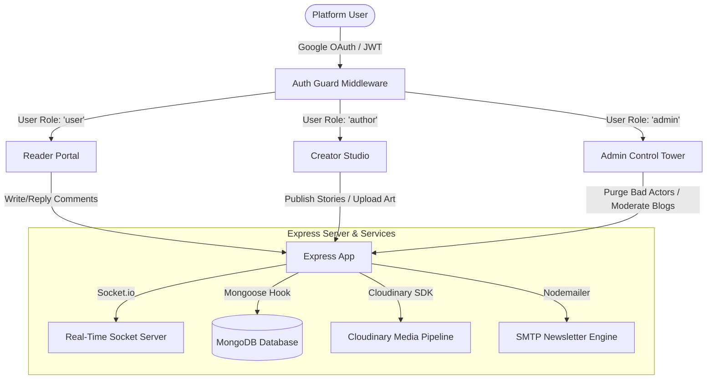

# ✍️ Blogy - Enterprise-Grade Full-Stack Publishing Platform

Blogy is a next-generation, full-stack multi-user content publication platform built to deliver an exceptionally polished, fast, and interactive writing experience. Designed for seamless collaboration and high discoverability, it connects readers, creators, and administrators inside a unified, high-performance web environment powered by real-time notification sockets, deep comment indexing, and automated newsletter distribution.

---

## 🚩 Problem Statement
Traditional content management systems and blog engines struggle to keep pace with the demands of modern web ecosystems:

* **Stagnant Reader Engagement:** Standard blog platforms render static, isolated articles, leaving readers feeling disconnected due to a lack of live notifications, instant responses, and active feed updates.
* **Media Overhead & Latency:** High-resolution blog banners and user avatars often lead to heavy payloads, slow page loads, and severely compromised Core Web Vitals (SEO) rankings.
* **Authentication Friction:** Cumbersome registration flows and weak account credentials deter casual readers and invite widespread spam profiles.
* **Author Inefficiency:** Creators are forced to manually compute read times, generate clean URL slugs, and handle media assets, leading to inconsistent metadata and broken site links.
* **Moderation Deficit:** Without strong central administrative panels, comment boards quickly devolve into unmonitored spam, while orphaned and toxic accounts pollute search relevance.

---

## 💡 The Solution: Blogy

Blogy addresses these core issues by establishing a highly interactive, unified operating space for digital creators and consumers. By coupling automated metadata calculations with real-time socket events, seamless OAuth onboarding, and cloud-optimized media delivery, Blogy transforms standard blogging into an active, social, and zero-friction publication experience.

---

## 🛠️ Tech Stack

### Frontend (User Interface)
* **Vite + React 19:** Bleeding-edge React rendering engine for lightning-fast compilation, hot module reloading, and highly optimized production bundles.
* **TypeScript:** Robust, end-to-end static type-safety across all component state schemas, custom routing pathways, and API stores.
* **Tailwind CSS:** Ultra-sleek, modern design system featuring custom dark modes, premium glassmorphism, responsive grids, and clean layout hierarchies.
* **Framer Motion:** High-fidelity animations, micro-interactions, smooth page transitions, and responsive hover feedbacks.
* **Zustand:** Centralized, decoupled state stores with lightweight footprints managing authentication sessions, live blogs, and threaded comments.
* **Axios & TanStack Query (React Query):** Structured, interceptor-driven API queries providing intelligent local caching, request retries, and automated token injections.
* **Lucide Icons & React Hot Toast:** Pixel-perfect visual iconography and responsive, elegant feedback alerts.

### Backend (Infrastructure)
* **Node.js & Express (TypeScript):** Highly organized, typed REST API architecture implementing layered controllers, route groups, and security middlewares.
* **MongoDB & Mongoose:** Scalable NoSQL document database featuring deep population modeling, fast indexing, and integrated pre-save event triggers.
* **Cloudinary API:** Automated cloud media hosting providing on-the-fly image compression, smart cropping, and secure, high-speed CDN delivery.
* **Socket.io:** Persistent, full-duplex TCP socket channels delivering instant user notification alerts, active session joins, and live system broadcasts.
* **Passport.js & JWT:** Complete dual-layer authentication engine merging secure local JSON Web Tokens (JWT) with Google OAuth 2.0 passport protocols.
* **Nodemailer:** Automated SMTP emailing pipeline with custom HTML templates supporting weekly newsletter campaigns and test-account sandboxing.

---

## ⚙️ How It Works (Architecture)



* **Dynamic Multi-Role Gatekeeping:** Users are assigned distinct roles (`user` | `author` | `admin`) via cryptographic JWT tokens stored securely. Workspaces, navigation elements, and dashboard utilities dynamically reconstruct based on these claims.
* **Automated Mongoose Pre-Save Pipeline:** Saving an article triggers Mongoose database middleware to instantly compute the reading time (`Math.ceil(words / 200)`) and auto-generate clean, SEO-optimized URL identifiers via `slugify`.
* **Optimistic UI State Updating:** Comments and likes are loaded optimistically. The client UI renders changes instantly upon click and silently performs DB synchronization in the background, recovering seamlessly if errors occur.
* **Dedicated Socket Notification Rooms:** On successful session authorization, clients join a dedicated private room via `Socket.io` matching their unique User ID, allowing targeted administrative alerts and real-time interaction pushes.
* **Relevance-Driven Analytics Aggregation:** A sophisticated MongoDB aggregation pipeline calculates article popularity indexes over a rolling 30-day window based on dynamic views and weighted likes (`score = views + likes * 5`).

---

## 🖥️ The 3 Power Workspaces

### 1. 🛡️ System Admin Dashboard (The Control Tower)
A powerful, central control terminal reserved for hospital-level platform administrators to oversee content sanity and user operations.
* **Active Module Switcher:** Swiftly transition between dedicated "Blogs Management" and "Users Management" panels within a unified, glassmorphic layout.
* **Platform auditing Stats:** Real-time counter metrics highlighting "Total Stories" and "Total Registered Users" across the system database.
* **Global Content Moderation:** Absolute oversight with the ability to instantly delete plagiarized, offensive, or non-compliant articles.
* **Cascade User Purging:** Wipe out bad actors or spam profiles permanently. Removing a user automatically executes a safe cascade that deletes all their corresponding blogs and database attachments.
* **Security Activity logs:** Audit accounts by tracking exact registration dates, profiles, and precise `lastLogin` timestamps.

### 2. ✍️ Creator Studio / Author Workspace (The Digital Ink)
A dedicated, distraction-free environment for writers and creators to manage their literary creations and build their audience.
* **Advanced Story Composer:** Structured writer interface equipped with input parameters for long-form content, titles, summaries, categorization, and tag keywords.
* **Cloudinary Media Pipeline:** Drag-and-drop cover image inputs that upload directly to Cloudinary, ensuring optimal performance via compressed web formats.
* **Visibility Control Toggles:** Effortlessly transition articles between draft status and live production.
* **Biographical customizer:** Modify avatar thumbnails, full name fields, and configure personal bio summaries to optimize reader discovery.

### 3. 👤 Reader Portal (Personalized Dashboard)
The primary engagement hub designed to provide readers with curated discoveries and highly interactive communities.
* **Curated Feeds & Trending Hubs:** Dynamically populated homepages segmented by "Recent Publications" and highly optimized "Trending Stories" lists.
* **Threaded Comment Node System:** Read and write nested, threaded message sections supporting multiple-level conversation branches and interactive comment upvoting.
* **Follow-Writer Pipeline:** Follow favorite content creators to dynamically update follower totals and build direct creator-reader relationships.
* **Interactive Bookmarks Drawer:** Instantly save must-read posts to a personal folder for fast offline access and easy retrieval.
* **Live Weekly Newsletter Widget:** Enter emails into the newsletter panel to receive highly stylized HTML newsletter dispatches via Nodemailer.

---

## ✨ Standout Features
* **Rolling Weighted Popularity Index:** Rather than relying on simple creation dates, the algorithm identifies trending stories using a math formula that values active reader likes at five times the weight of standard page visits.
* **Threaded Conversation Networks:** Highly organized comment trees that support unlimited nested conversations with responsive optimistic upvotes.
* **Behind-the-Scenes Pre-Save Hooks:** Automatically handles read time estimates and web-safe slug conversions inside MongoDB, completely removing human error from creator workflows.
* **Dual-Layer Secured Authentication:** Provides secure password hashing via `bcryptjs` and OAuth 2.0 integration with Google Accounts, generating resilient JWT access and refresh token states.
* **Asynchronous Mail Sandbox:** Automatically identifies local SMTP settings. If real SMTP keys are omitted in staging, the system seamlessly initializes an Ethereal sandbox profile, delivering a clickable browser URL to inspect live rendered newsletter campaigns visually.

---

## 📦 Deployment & Setup

### Production Live Links
* **Frontend (Vercel):** `https://blogy-platform.vercel.app`
* **Backend (Render):** `https://blogy-backend.onrender.com`

### Admin Credentials (Demo Setup)
* **Email:** `admin@blogy.dev`
* **Password:** `Toshan@0001`

### Local Installation

#### 1. Clone the Repository
```bash
git clone https://github.com/heytoshan/blog-app.git
cd blog-app
```

#### 2. Configure Environment Variables
Set up environment files in both client and server directories to route database connections, OAuth clients, and storage buckets:

##### Backend Env Configuration
Create a `.env` file in the `./server` folder:
```env
PORT=5000
NODE_ENV=development
MONGODB_URI=mongodb+srv://<username>:<password>@cluster.mongodb.net/blogy?retryWrites=true&w=majority
JWT_SECRET=your_super_secret_jwt_key_here
JWT_EXPIRES_IN=30d

# Google OAuth
GOOGLE_CLIENT_ID=your_google_client_id.apps.googleusercontent.com
GOOGLE_CLIENT_SECRET=your_google_client_secret
CALLBACK_URL=http://localhost:5000/api/v1/auth/google/callback

# Cloudinary
CLOUDINARY_CLOUD_NAME=your_cloudinary_cloud_name
CLOUDINARY_API_KEY=your_cloudinary_api_key
CLOUDINARY_API_SECRET=your_cloudinary_api_secret

# SMTP (Email) - Leave blank to use ethereal sandbox previewer
SMTP_HOST=smtp.gmail.com
SMTP_PORT=587
SMTP_USER=your_email@gmail.com
SMTP_PASS=your_gmail_app_password

# CORS Settings
CLIENT_URL=http://localhost:5173
```

##### Frontend Env Configuration
Create a `.env` file in the `./client` folder:
```env
VITE_API_URL=http://localhost:5000/api/v1
VITE_SOCKET_URL=http://localhost:5000
```

#### 3. Install Dependencies
```bash
# Install client-side dependencies
cd client
npm install

# Install server-side dependencies
cd ../server
npm install
```

#### 4. Seed Database & Create Admin Account
Populate your database with beautiful, rich sample data (blogs, users, threaded comments) and initialize the default super administrator account:
```bash
# From the /server directory:

# Run the rich database seeder
npm run seed

# Run the administrative setup script
npx tsx src/scripts/createAdmin.ts
```

#### 5. Launch the Application Locally
Run the concurrent dev environments to launch both client and server servers:

```bash
# In the /server terminal
npm run dev

# In a separate /client terminal
npm run dev
```

Your browser will automatically open `http://localhost:5173`, linking with the hot-reloaded REST/Socket.io backend running on `http://localhost:5000`.

---

Developed with ❤️ by Toshan | heytoshan/blog-app
